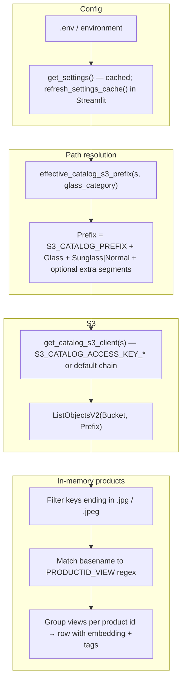
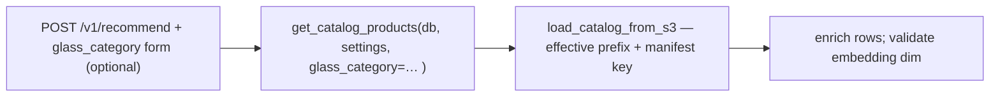

# S3 catalog fetch flow (RS2)

How configuration becomes an in-memory product list, and how that differs from the **HTTP API** path when using a **manifest** on S3.

## Flat catalog (Streamlit, CLIs, `build_lusmt_flat_catalog`)

Used when the app lists JPEG keys under a prefix and groups them by `PRODUCTID_VIEWINDEX.jpg`.

## API catalog (`CATALOG_SOURCE` auto + manifest on S3)

`get_catalog_products` calls `load_catalog_from_s3`, which uses the **same** `effective_catalog_s3_prefix` for the manifest and embedding sidecar keys (regional JSON still joins against base `S3_CATALOG_PREFIX` for `load_regional_from_s3` when configured).

## Credential split

- **Rekognition / user selfie objects:** default AWS credential chain (`AWS_*`).
- **Catalog bucket (optional):** `S3_CATALOG_ACCESS_KEY_ID` + `S3_CATALOG_SECRET_ACCESS_KEY` if the catalog lives under another account or key pair.

## Related modules

| Module | Role |
|--------|------|
| `app/config.py` | `Settings`, `refresh_settings_cache` |
| `app/services/catalog_s3_prefix.py` | `effective_catalog_s3_prefix`, `catalog_listing_fingerprint` |
| `app/services/s3_flat_catalog.py` | `build_lusmt_flat_catalog`, `diagnose_flat_catalog`, `ListObjectsV2` |
| `app/services/s3_image.py` | `get_catalog_s3_client` |
| `app/services/s3_catalog.py` | Manifest + sidecar load for the API path |
| `app/services/catalog.py` | `get_catalog_products` (DB vs S3) |
