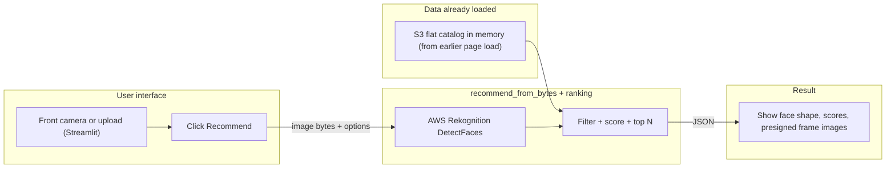
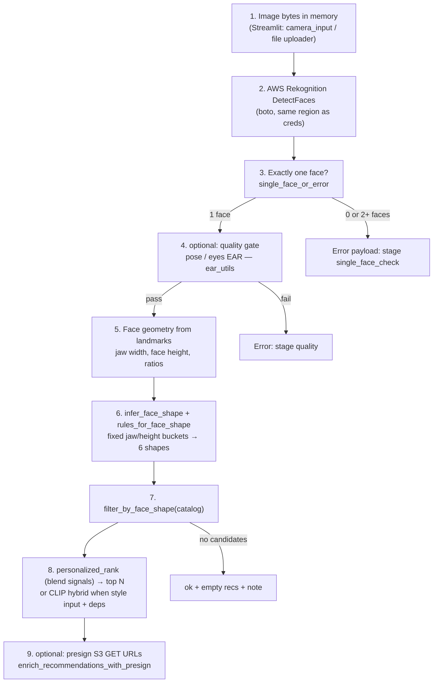
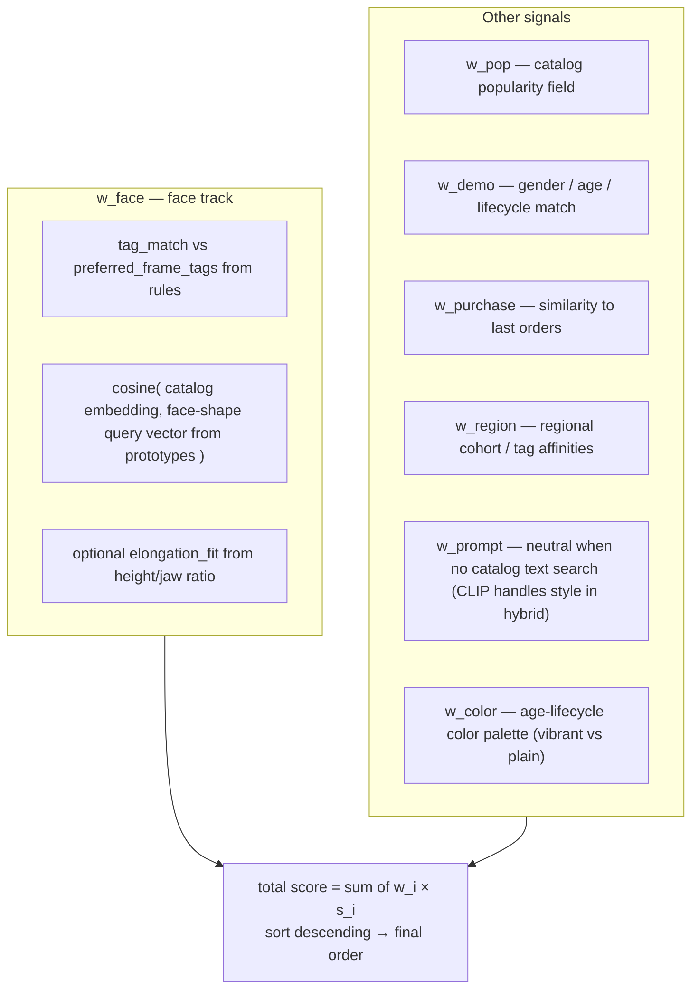
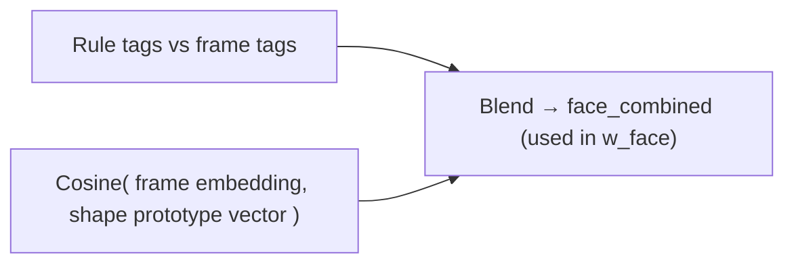
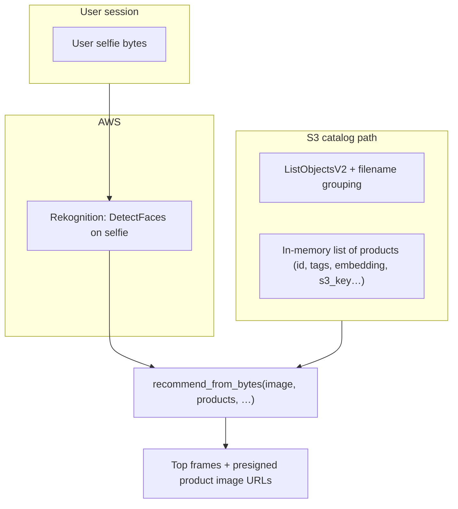

# User journey & ranking (RS2)

End-to-end flow when someone uses the **front camera** (or upload) in Streamlit, plus how **ranking** blends signals. The same core path runs for the HTTP API when you POST a selfie.

---

## 1. User journey (high level)

---

## 2. Stages the selfie image passes through

This matches `glasses_recommend.recommend_from_bytes` in order.

**Failure points (early return):** no single face, quality check failed, or no catalog rows for that face shape.

---

## 2b. Optional CLIP preference hybrid (style text / image + face-rules)

When the user provides **style text** and/or a **style reference image**, **hybrid** is enabled in settings, **CLIP** is enabled, and products have **`clip_embedding`**, the app:

1. Runs `personalized_rank` with **`w_prompt` forced to 0** (other weights renormalized), so the inner score is “face + popularity + region + color + last order + …” without a legacy text-match slot.
2. Builds a **CLIP preference** on the same candidates: cosine of the query embedding (from text and/or image) vs each product’s `clip_embedding`.
3. **Blends** with configurable weights from **environment** (default 60% / 40%):  
   `final = w_preference × clip_preference + w_face × normalize(inner_total)`.

If there is no style input or CLIP cannot run, a **single** `personalized_rank` runs with **no** style tokens (neutral inner text slot).

---

## 3. Ranking: weighted score blend

Each **candidate frame** (after face-shape filter) gets a scalar `score` = weighted sum of sub-scores, or the hybrid blend when CLIP runs. Weights are `RankingWeights` in `ranking_signals.py` (renormalized to sum to 1). When the hybrid path is used, the **displayed** `score` is the hybrid blend above; `score_breakdown` gains a `hybrid` sub-object and still lists inner components.

**Response shape:** each recommendation includes `score` and `score_breakdown` (per-component values + resolved `weights`).

---

## 4. “Face hybrid” inside w_face (conceptual)

`face_hybrid_with_similarity` combines rule tag overlap with embedding similarity to the **query vector** for the detected face shape (from `load_face_shape_prototypes` or defaults).

---

## 5. System context: catalog vs selfie

Catalog images are **not** sent to Rekognition with the user photo in one batch. The app loads **product metadata (and keys)** from S3 (or DB) **before** or alongside the request; the selfie only drives face analysis and scoring.

---

## 6. Streamlit vs API (same engine)

| Entry | How image arrives | Catalog |
|--------|-------------------|---------|
| **Streamlit** | `st.camera_input` / upload → `recommend_from_bytes` | S3 flat catalog from `_s3_product_rows` |
| **FastAPI** | Multipart `image` or `s3_key` (download bytes) | `get_catalog_products` (S3 manifest or DB) + same `recommend_from_bytes` |

Both end in **`recommend_from_bytes`** → **personalized_rank**; Streamlit then calls **`enrich_recommendations_with_presign`**.

---

## 7. Optional reading order in code

1. `streamlit_app.py` — UI and `recommend_from_bytes` + presign
2. `glasses_recommend.py` — `recommend_from_bytes`
3. `ranking_signals.py` — `personalized_rank`, `RankingWeights`, `score_*` helpers
4. `app/services/s3_flat_catalog.py` — how S3 objects become `products` rows
5. `app/services/s3_image.py` — presigned GET URLs
